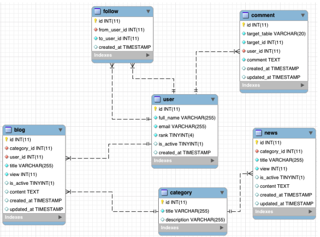

# SQL

## Exercises

1. Create the database as shown above.
2. Insert data into each table (at least 10 rows per table).
3. Delete and update 1 row of data in any table.
4. Select the 10 newest active blogs.
5. Get 5 blogs starting from the 10th blog.
6. Set `is_active = 0` for the user with `id = 3` in the `user` table.
7. Delete all comments by user `2` in blog `5`.
8. Get 3 random blogs.
9. Get the number of comments for each blog.
10. Get Categories that have an active blog or news item (do not duplicate categories).
11. Get the total number of views for each category through blogs and news.
12. Get blogs created by users who do not have any comments on blogs.
13. Get the 5 newest blogs and the number of comments for each blog.
14. Get the first 3 Users who commented in the 5 newest blogs.
15. Update `rank` for user `2` when the user's total number of comments is greater than 10.
16. Select the 10 newest blogs created by active users.
17. Get the number of active Blogs for users with IDs `1`, `2`, and `4`.
18. Get 5 blogs and 5 news items from any category.
19. Get the blog and news item with the highest number of views.
20. Get blogs created within the last 3 days.
21. Get the list of users who commented on the 2 newest blogs.
22. Get 2 blogs and 2 news items that user `id = 1` has commented on.
23. Get 1 blog and 1 news item with the highest number of comments.
24. Get the 5 newest active blogs and 5 newest active news items.
25. Get comment content in blogs and news items from user `id = 1`.
26. Blogs belonging to users followed by user `id = 1`.
27. Get the number of users who are following user `1`.
28. Get the number of users that user `1` is following.
29. Get the latest comment (`id_comment`, `comment`) and the user information
    of the user followed by user `1`.
30. Display a string `"Back-end Team "` + the current date and time.
    Example: `Back-end Team 2017-06-21 13:06:37`

## Notes

- The comment table contains comments from both Blog and News. Based on the `target_table` and `target_id` fields, `target_table` has two possible values: `blog` and `news`.
- Examples:
  - `target_table = "blog"` and `target_id = 3`: Comment of the Blog with `id = 3`
  - `target_table = "news"` and `target_id = 2`: Comment of the News with `id = 2`
- The `follow` table has two foreign keys: `from_user_id` and `to_user_id`, both `REFERENCES user(id)`.
  If user 1 follows user 2, then `from_user_id = 1` and `to_user_id = 2`.